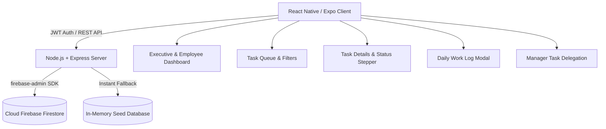

# ⚡ TaskMaster Pro - Employee Task Manager

> A modern, role-based Task Management and Daily Work Log application built with **React Native (Expo)**, **Node.js Express REST API**, and **Google Cloud Firebase Firestore**, featuring dark glassmorphic styling and spring touch animations.

---

## 🌟 Key Features

- 👑 **Role-Based Access Control (RBAC)**:
  - **Manager Role**: Assign tasks with deadlines and priorities, monitor team productivity gauges, view all tasks, and delete/modify assignments.
  - **Employee Role**: View assigned tasks, transition status (`Pending` ➔ `In Progress` ➔ `Completed`), and submit daily work update logs with progress percentages and hours spent.
- 🚀 **1-Tap Quick Demo Switcher**: Instant one-click authentication as Manager (**Sarah Jenkins**) or Employees (**Rahul Sharma**, **Alex Chen**, **Priya Patel**) for friction-free employer testing.
- 🎨 **Glassmorphic Visual Design System**:
  - Translucent frosted glass cards with subtle luminous borders.
  - Interactive spring scale touch feedback on buttons.
  - Vibrant neon status badges (`Pending`, `In Progress`, `Completed`) and priority markers (`High`, `Medium`, `Low`).
  - Dynamic gradient progress bars with live percentage calculations.
- 🔄 **Workflow Status Transition Stepper**: One-tap milestone transitions with instant backend synchronization.
- 📝 **Daily Work Updates History Timeline**: Employees log hours, blocker flags, notes, and progress increments which automatically roll up into executive dashboard analytics.
- 🔥 **Dual-Mode Database Architecture**: Operates with genuine **Cloud Firebase Firestore** via `firebase-admin` or instant zero-config in-memory seed dataset for offline/local evaluation.

---

## 🏗️ Tech Stack

| Layer | Technologies |
| :--- | :--- |
| **Mobile / Frontend** | React Native, Expo SDK 51, React Native Web, `expo-linear-gradient`, `lucide-react-native`, Axios |
| **Backend API** | Node.js, Express.js, CORS, JSON Web Tokens (JWT), bcryptjs, uuid |
| **Database** | Google Cloud Firebase Firestore (`firebase-admin`), In-Memory Fallback Seed Engine |
| **Architecture** | Clean REST API with Layered Controllers, Middleware, and RBAC |



---

## 📱 Core Screens Overview (~6 Dedicated Screens)

1. **Login & 1-Tap Quick Demo Switcher**: Instant role login cards for Sarah (Manager) and Rahul/Alex (Employees), plus standard email/password registration.
2. **Executive Dashboard**: Metric stat cards (Total, In Progress, Completed, Pending), circular completion rate gauge, team productivity breakdown, and live activity stream.
3. **Task Queue (My Tasks / Team Tasks)**: Real-time search, status filter pills (`All`, `Pending`, `In Progress`, `Completed`), priority filters (`High`, `Medium`, `Low`), and manager floating add button.
4. **Task Details**: Complete task specifications, interactive status transition stepper, assignee & manager cards, and full history of daily work updates.
5. **Add Daily Work Update**: Quick progress presets (`25%`, `50%`, `75%`, `100%`), step adjustments, hours logged counter (`+0.5h`), work notes textarea, and blocker toggle.
6. **User Profile & Diagnostics**: User avatar, employee code, department, live Express backend & Firebase connection health indicator, and re-seed button.
7. **Manager Task Delegation Modal**: Direct assignment dropdown for team members, priority levels, category tags, and deadline selection.

---

## 👥 Pre-Seeded Demo Accounts

| Role | Name | Email | Password | Code | Responsibilities |
| :--- | :--- | :--- | :--- | :--- | :--- |
| 👑 **Manager** | Sarah Jenkins | `manager@company.com` | `password123` | `MGR-001` | Engineering Lead / Assigns tasks & tracks delivery |
| 💻 **Employee** | Rahul Sharma | `rahul@company.com` | `password123` | `EMP-104` | Mobile Frontend Engineer / Builds UI & updates progress |
| ⚡ **Employee** | Alex Chen | `alex@company.com` | `password123` | `EMP-108` | Backend & Cloud Engineer / REST APIs & Firebase |
| 🎨 **Employee** | Priya Patel | `priya@company.com` | `password123` | `EMP-112` | UI/UX & Design Systems |

---

## 🚀 Quick Start Guide

### 1. Start the Backend Server
```bash
cd backend
npm install
npm start
```
*The backend starts at `http://localhost:5000` and automatically seeds demo data.*

### 2. Start the Mobile Client
In a new terminal window:
```bash
cd mobile
npm install
# To preview in web browser immediately:
npm run web

# Or to run on mobile device with Expo Go:
npm start
```

---

## 📡 REST API Reference

### Authentication (`/api/auth`)
- `POST /api/auth/login`: Authenticate with email & password.
- `POST /api/auth/register`: Register a new user with role (`manager` or `employee`).
- `GET /api/auth/demo-profiles`: Fetch list of pre-seeded demo accounts.
- `POST /api/auth/demo-login`: 1-tap instant demo authentication.
- `GET /api/auth/employees`: Retrieve all team members (for task assignment).

### Tasks (`/api/tasks`)
- `GET /api/tasks`: List tasks with query filters (`status`, `priority`, `search`).
- `GET /api/tasks/:id`: Get single task with nested work update history.
- `POST /api/tasks`: Create & assign new task *(Manager only)*.
- `PATCH /api/tasks/:id/status`: Update status (`Pending` ➔ `In Progress` ➔ `Completed`).
- `PUT /api/tasks/:id`: Update task metadata *(Manager only)*.
- `DELETE /api/tasks/:id`: Remove task *(Manager only)*.

### Daily Work Updates (`/api/tasks/:taskId/updates`)
- `POST /api/tasks/:taskId/updates`: Add daily work log with progress %, hours spent, notes, and blocker flag.
- `GET /api/tasks/:taskId/updates`: Fetch timeline of work logs for a task.

### Analytics & System (`/api/analytics`, `/api/health`, `/api/seed`)
- `GET /api/analytics/dashboard`: Fetch aggregated metrics, completion rate, and team breakdown.
- `GET /api/health`: Check server and Firebase Firestore connection status.
- `POST /api/seed`: Re-seed database with fresh demo records.

---

## 📖 Setup & Deployment Guides
- **Firebase Setup (CLI & Manual)**: [FIREBASE_SETUP_GUIDE.md](FIREBASE_SETUP_GUIDE.md)
- **GitHub Push Guide**: [GITHUB_SETUP.md](GITHUB_SETUP.md)
